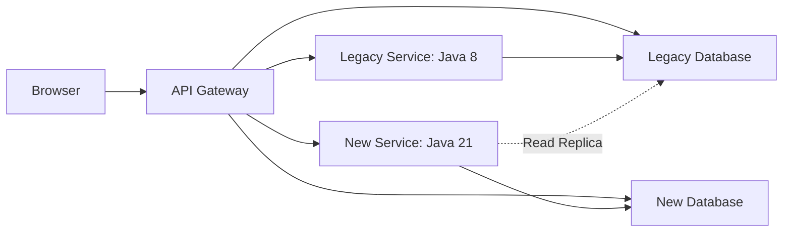

# Глава 6: Стратегия миграции — Strangler Fig, CI/CD и Feature Toggles

> «Миграция без стратегии — это гарантированный Big Bang с остановкой бизнеса». 

В этой главе — техническая стратегия, которая позволила провести миграцию Java 8 + Angular 8 → Java 21 + Angular 20 **без остановки production-системы** и с минимизацией рисков для бизнеса.

---

## 6.1. Strangler Fig Pattern (Поэтапное вырезание модулей)

**Strangler Fig Pattern** (паттерн «Удушающий инжир») — это архитектурный подход, при котором новый функционал постепенно заменяет старый, пока старый полностью не "отомрёт".

Название взято из природы: инжир-душитель начинает расти вокруг дерева-хозяина, постепенно оплетая его, пока дерево-хозяин не погибает.

### Как это работало у нас

```
Этап 1: Новый код сосуществует со старым
[API Gateway]
  ├── /api/orders/*    → NEW Service (Java 21)
  └── /api/users/*     → LEGACY Monolith (Java 8)

Этап 2: Постепенное вырезание
[API Gateway]
  ├── /api/orders/*    → NEW Service
  ├── /api/users/*     → NEW Service  
  └── /api/reports/*   → LEGACY Monolith (Java 8)

Этап 3: Полная замена
[API Gateway]
  └── /api/*           → NEW Microservices ecosystem
```

### Критерии выбора модуля для первого вырезания

Мы выбирали первый модуль для миграции по следующим критериям:

1. **Низкая связанность** (low coupling) — модуль минимально зависит от других.
2. **Чёткие границы** (bounded context) — понятный API.
3. **Изолированные данные** — своя таблица/схема в БД.
4. **Некритичный функционал** — можно откатить без влияния на бизнес.

> **Подводный камень (Gotcha):** Первым модулем для миграции часто выбирают самый простой. Это ошибка. Лучше выбрать **средней сложности** — он покажет реальные проблемы, но не заблокирует проект. Слишком простой модуль создаст ложное ощущение лёгкости, слишком сложный — деморализует команду.

### Техническая схема параллельной работы



На этапе параллельной работы новый сервис **читает данные из старой БД** (через read-replica) и **пишет в новую**. После полной верификации старый сервис отключается.

---

## 6.2. Feature Toggles и параллельный запуск

**Feature Toggles (Feature Flags)** — механизм, позволяющий включать/выключать функциональность без деплоя кода.

### Типы тоглов в миграции

| Тип тогла | Назначение | Пример |
|-----------|-----------|--------|
| **Release Toggle** | Включение новой версии модуля | `orders-service-v2` |
| **Experiment Toggle** | A/B тестирование старого vs нового | `use-new-search-algorithm` |
| **Ops Toggle** | Аварийное отключение | `disable-new-orders-service` |
| **Permission Toggle** | Доступ для конкретных пользователей | `beta-tester-migration` |

### Backend: Feature Toggle в Spring Boot

```java
@Component
public class FeatureToggleService {
    private final Map<String, Boolean> toggles = new ConcurrentHashMap<>();

    public FeatureToggleService() {
        // По умолчанию все новые фичи выключены
        toggles.put("new-orders-service", false);
        toggles.put("new-java-21-pool", false);
    }

    public boolean isEnabled(String feature) {
        return toggles.getOrDefault(feature, false);
    }

    @Scheduled(fixedRate = 60000)
    public void refreshToggles() {
        // Читаем актуальные значения из внешнего источника (Consul/Redis)
    }
}
```

Использование в Gateway-фильтре:

```java
@Component
public class MigrationRoutingFilter implements GatewayFilter {
    
    @Override
    public Mono<Void> filter(ServerWebExchange exchange, GatewayFilterChain chain) {
        String path = exchange.getRequest().getURI().getPath();

        if (path.startsWith("/api/orders") && featureToggle.isEnabled("new-orders-service")) {
            // Перенаправляем на новый микросервис
            URI newUri = URI.create("http://orders-service-v2:8081" + path);
            exchange.getRequest().mutate().uri(newUri);
        }
        // Иначе — старый монолит
        return chain.filter(exchange);
    }
}
```

### Frontend: Feature Toggle в Angular

```typescript
@Injectable({ providedIn: 'root' })
export class FeatureToggleService {
    private toggles = signal<Record<string, boolean>>({});

    constructor() {
        this.loadToggles();
    }

    private loadToggles() {
        // Загружаем конфигурацию с /api/config/toggles
        this.http.get<Record<string, boolean>>('/api/config/toggles')
            .subscribe(t => this.toggles.set(t));
    }

    isEnabled(feature: string): boolean {
        return this.toggles()[feature] ?? false;
    }
}
```

В шаблоне Angular:

```html
@if (featureToggle.isEnabled('new-orders-ui')) {
    <app-orders-list-standalone />
} @else {
    <app-orders-list-legacy />
}
```

---

## 6.3. CI/CD: Две ветки, Canary Releases, Parallel Support

### Две ветки (Git Branch Strategy)

Мы использовали модифицированный GitFlow с двумя активными ветками:

```
main (Java 21 + Angular 20)
  └── hotfixes (критические исправления, cherry-pick в обе)

legacy (Java 8 + Angular 8)
  └── migration-bridge (подготовительные изменения для обратной совместимости)
```

**Принцип:** Любой новый код сначала писался с поддержкой обоих стеков (через Feature Toggles), затем деплоился на `legacy`, а после верификации — на `main`.

### Canary Releases

Процесс раскатки новой версии модуля:

1. **5% трафика** — 1 день, мониторинг ошибок и метрик (latency, error rate).
2. **25% трафика** — 2 дня, проверка Edge Cases.
3. **50% трафика** — 2 дня, нагрузочное тестирование.
4. **100% трафика** — финальное включение, старая версия отключается.

### Parallel Support (Обратная совместимость)

До полной миграции мы поддерживали оба стека одновременно:

- **Общая БД** — мигрированные и немигрированные модули работали с одной базой.
- **API-версионирование** — `GET /api/v1/orders` (старый) и `GET /api/v2/orders` (новый).
- **Contract Testing** — Pact-тесты гарантировали, что старый и новый API возвращают одинаковые ответы.

---

## 6.4. SLA и Analyse d'Impact

### Analyse d'Impact (Анализ влияния)

Перед каждым изменением в рамках миграции мы проводили формальный анализ:

1. **Scope (Объём)** — какие модули, классы, таблицы БД затронуты.
2. **Impact (Влияние)** — какие внешние системы и бизнес-процессы зависят от изменяемого модуля.
3. **Risk (Риск)** — категория риска (Critical / High / Medium / Low).
4. **Rollback Plan** — точная процедура отката.
5. **Test Strategy** — какие тесты должны пройти до и после.

### Как оценивать SLA в миграции

SLA (Service Level Agreement) — это контракт об уровне услуг. Для миграции критически важны:

| Метрика | Цель | Единица измерения |
|---------|------|------------------|
| **GTI** (Garantie de Temps d'Intervention) | < 15 мин | Время от инцидента до начала работы |
| **GTR** (Garantie de Temps de Rétablissement) | < 2 часа | Время до восстановления сервиса |
| **Availability** | 99.9% | Uptime за месяц |
| **Error Rate** | < 0.1% | Доля ошибочных запросов |

### Шпаргалка SLA для Senior-интервью

> «В промышленном окружении с SLA 99.9% мы не могли позволить себе Big Bang. Каждое изменение проходило Analyse d'Impact, покрывалось Characterisation Tests, вводилось через Feature Toggle и раскатывалось Canary-релизом за 3–5 дней. Время отката (rollback) не превышало 15 минут благодаря Blue-Green деплою и K8s Probes.»

---

## 6.5. Stop-Go решения (Quality Gates)

Миграция не может идти «любой ценой». Мы установили чёткие **Quality Gates** — критерии, при которых миграция **останавливалась** и спринт посвящался стабилизации:

| Gate | Критерий | Действие при нарушении |
|------|---------|----------------------|
| **Test Coverage** | < 70% для нового кода | STOP — добавить тесты |
| **SonarQube** | Ошибки качества (Blocker/Critical) | STOP — исправить до продолжения |
| **Performance** | Latency P95 выше baseline на 20% | STOP — профилировать и оптимизировать |
| **Error Rate** | > 0.5% ошибок API после Canary | STOP — откатить Feature Toggle |
| **Memory** | Heap consumption > 80% | STOP — проанализировать Heap Dump |

### Как это работало на практике

```yaml
# CI/CD Pipeline Check: Quality Gate
quality-gate:
  stage: verification
  script:
    - ./gradlew test jacocoTestReport
    - ./gradlew sonarqube
    - |
      coverage=$(jq -r '.coverage' build/reports/coverage.json)
      if [ "$coverage" -lt 70 ]; then
        echo "FAIL: Coverage $coverage% < 70%"
        exit 1
      fi
    - echo "PASS: Quality Gate passed"
```

---

## 6.6. Инструменты автоматизации миграции

### OpenRewrite (Java)

**OpenRewrite** — инструмент автоматического рефакторинга кода. Мы использовали его для массовой замены `javax.*` → `jakarta.*`:

```bash
# Применить рецепт миграции Jakarta
mvn -U org.openrewrite.maven:rewrite-maven-plugin:run \
  -Drewrite.recipeArtifactCoordinates=org.openrewrite.recipe:rewrite-spring:LATEST \
  -Drewrite.activeRecipes=org.openrewrite.java.spring.boot3.SpringBoot3BestPractices
```

OpenRewrite автоматически:
- Заменяет импорты (`javax.persistence` → `jakarta.persistence`).
- Обновляет конфигурацию Security (`WebSecurityConfigurerAdapter` → `SecurityFilterChain`).
- Мигрирует Hibernate 5 → 6.

### Angular Schematics (`ng update`)

Для Angular используется встроенный механизм `ng update`:

```bash
# Пошаговое обновление Angular
nvm use 12 && ng update @angular/core@9 @angular/cli@9
nvm use 14 && ng update @angular/core@12 @angular/cli@12
nvm use 18 && ng update @angular/core@15 @angular/cli@15
nvm use 20 && ng update @angular/core@20 @angular/cli@20
```

Важно: `ng update` выполняет **схематики (schematics)** — скрипты, которые автоматически обновляют конфигурацию, заменяют deprecated-код и меняют API.

---

## 6.7. Parallel Run: Валидация идентичности (Diff Validation)

Для критических модулей мы запускали **Parallel Run** — старый и новый сервис обрабатывали одни и те же запросы параллельно, но ответ пользователю возвращался только от старого. Ответы сравнивались для валидации.

```java
@Component
public class OrdersMigrationValidator {
    
    public void validateParallelRun(OrderRequest request) {
        // 1. Отправляем запрос в оба сервиса
        CompletableFuture<OrderResponse> legacy = 
            CompletableFuture.supplyAsync(() -> legacyClient.getOrders(request));
        CompletableFuture<OrderResponse> modern = 
            CompletableFuture.supplyAsync(() -> modernClient.getOrders(request));
        
        // 2. Сравниваем ответы
        OrderResponse oldResponse = legacy.get();
        OrderResponse newResponse = modern.get();
        
        boolean isIdentical = diffService.compare(oldResponse, newResponse);
        
        if (!isIdentical) {
            // 3. Если не совпадают — логируем и шлём алерт
            alertService.sendMigrationAlert("Orders API mismatch detected");
            metricsService.incrementMigrationError();
        } else {
            metricsService.incrementMigrationSuccess();
        }
    }
}
```

---

### Резюме стратегии для собеседования

> «Мы использовали **Strangler Fig Pattern** — ни один модуль не мигрировался Big Bang'ом. Каждый функциональный срез проходил через Feature Toggle, Canary Release и Parallel Run. CI/CD был настроен на две параллельные ветки. Если Quality Gates не проходили — миграция останавливалась до стабилизации. Это позволило провести 2.5-летнюю миграцию с нулевым даунтаймом для бизнеса.»

---

**Что дальше:** В Главе 7 — детальный разбор миграции Java 8 → Java 21 с кодом и примерами.
