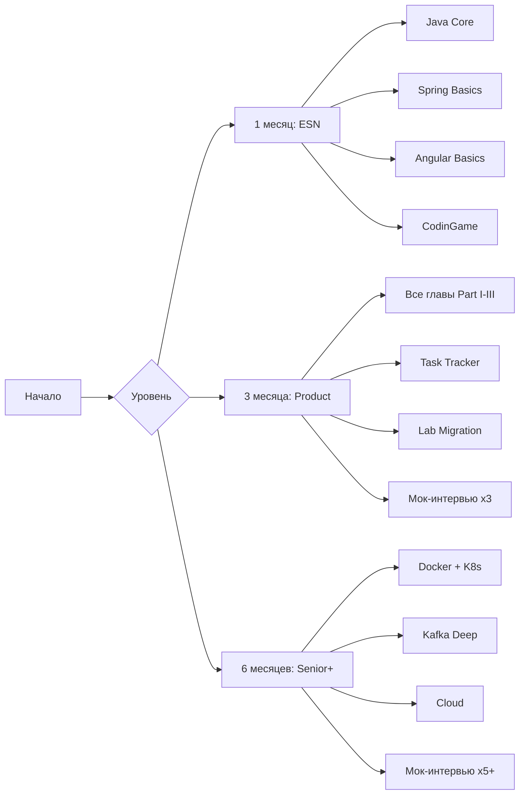

# Глава 18: Финальный чек-лист Senior-разработчика (Java + Angular)

> **Цель:** Объективно оценить свою готовность к позиции Senior Full-Stack Developer (Java + Angular) на французском рынке. Получить чёткий план подготовки на 1, 3 и 6 месяцев.
> **Аудитория:** Разработчики с опытом 3+ лет, целящиеся в Senior (I/Cadre) во французских ESN или продуктовых компаниях.

---

## 1. Технический аудит: Что я знаю vs Что нужно знать

### Самооценка по 10 ключевым компетенциям

Поставьте себе оценку от 1 (не знаю) до 5 (могу обучить других) по каждому блоку:

| # | Компетенция | Оценка (1–5) | Цель Senior |
|---|------------|:-----------:|:-----------:|
| 1 | **Java Core**: Collections, Streams, Generics, Records, Exceptions | | 4 |
| 2 | **OOP + SOLID**: Наследование, полиморфизм, интерфейсы, DI | | 5 |
| 3 | **Многопоточность**: Virtual Threads, synchronized, lock, ExecutorService | | 4 |
| 4 | **Spring Boot**: IoC, REST, JPA, AOP, Security, Testing | | 5 |
| 5 | **Базы данных**: SQL, индексы, N+1, ACID, оптимистичная/пессимистичная блокировка | | 4 |
| 6 | **Angular**: Components, DI, Forms, Routing, Standalone, Signals | | 4 |
| 7 | **RxJS + Signals**: Subjects, operators, switchMap, debounceTime, computed, effect | | 4 |
| 8 | **Микросервисы**: REST, Kafka/RabbitMQ, Resilience4j, Transactional Outbox | | 3 |
| 9 | **DevOps**: Docker, CI/CD, Kubernetes, SonarQube, Observability | | 3 |
| 10 | **Архитектура + Soft Skills**: Migration story, pitch, код-ревью, техдолг | | 5 |

### Анализ разрыва (Gap Analysis)

- **Зелёная зона (4–5):** Ваши сильные стороны — опирайтесь на них на интервью.
- **Жёлтая зона (3):** Требуется повторение и практика (2–3 дня на тему).
- **Красная зона (1–2):** Критический пробел — выделите 1–2 недели на изучение.

---

## 2. 10 компетенций Senior Java/Angular Developer

### 2.1. Java Core & JVM

| Тема | Что нужно знать |
|------|----------------|
| **Garbage Collection** | Разница GC (G1GC, ZGC, Shenandoah), когда что выбирать, Stop-The-World паузы |
| **Virtual Threads** | Project Loom, structured concurrency, `Executors.newVirtualThreadPerTaskExecutor()` |
| **Records & Sealed Classes** | Неизменяемые DTO, запечатанные иерархии |
| **Pattern Matching** | `switch` expressions, `instanceof` pattern matching |
| **Collections & Streams** | `toList()`, `Collectors.toMap()`, `flatMap`, параллельные стримы |

**Вопрос на интервью:** *«Какая разница между G1GC и ZGC? В каком сценарии вы выберете ZGC?»*

### 2.2. Spring Boot Deep Dive

| Тема | Что нужно знать |
|------|----------------|
| **Bean Lifecycle** | `@PostConstruct`, `InitializingBean`, `BeanPostProcessor` |
| **@Transactional** | Proxy-mode, self-invocation, propagation levels, `@Transactional(rollbackFor = ...)` |
| **Security** | SecurityFilterChain, JWT, OAuth2, BFF pattern, HttpOnly cookies |
| **Testing** | JUnit 5, Mockito, Testcontainers, `@WebMvcTest`, `@DataJpaTest` |
| **AOP** | `@Aspect`, `@Around`, `@Before`, pointcut expressions |

**Вопрос на интервью:** *«Как решить проблему Self-Invocation при использовании @Transactional?»*

### 2.3. Базы данных и JPA

| Тема | Что нужно знать |
|------|----------------|
| **N+1 problem** | `JOIN FETCH`, `@EntityGraph`, batch size |
| **Locking** | Optimistic (`@Version`), Pessimistic (`@Lock`), `FOR UPDATE` |
| **Indexes** | B-Tree, composite index, covering index, `EXPLAIN ANALYZE` |
| **Migrations** | Flyway, Liquibase, Versioned vs Repeatable migrations |

**Вопрос на интервью:** *«Как работает композитный индекс (status, created_at)? Будет ли он использован для WHERE created_at > ? без status?»*

### 2.4. Angular Core

| Тема | Что нужно знать |
|------|----------------|
| **Standalone** | `standalone: true`, отказ от `NgModule`, tree-shaking |
| **Signals** | `signal()`, `computed()`, `effect()`, `input()`, `output()`, `model()` |
| **Control Flow** | `@if`, `@for`, `@switch`, `@empty` |
| **Reactive Forms** | `FormBuilder`, `Validators`, typed forms, cross-field validation |
| **DI** | `inject()`, `providedIn: 'root'`, `@Injectable()`, injection tokens |

**Вопрос на интервью:** *«В чём разница между signal и BehaviorSubject? Когда использовать Signals, а когда RxJS?»*

### 2.5. RxJS для Senior

| Тема | Что нужно знать |
|------|----------------|
| **Subjects** | Subject vs BehaviorSubject vs ReplaySubject vs AsyncSubject |
| **Операторы** | `switchMap`, `mergeMap`, `concatMap`, `exhaustMap`, `debounceTime`, `catchError` |
| **Отписка** | `takeUntilDestroyed()`, `async` pipe, `takeUntil` |
| **Error Handling** | `catchError`, `retry`, `retryWhen` |

**Вопрос на интервью:** *«Как сделать Refresh Token, чтобы N параллельных 401 запросов не вызвали N параллельных refresh-запросов?»*

### 2.6. Микросервисы и Архитектура

| Тема | Что нужно знать |
|------|----------------|
| **Strangler Fig** | Поэтапная миграция монолита, feature toggles |
| **Resilience4j** | Circuit Breaker, Retry, Bulkhead, Rate Limiter |
| **Kafka** | Topics, partitions, consumer groups, exactly-once semantics, DLQ |
| **Saga Pattern** | Choreography vs Orchestration, compensation транзакции |
| **CQRS** | Разделение чтения и записи, Event Sourcing |

**Вопрос на интервью:** *«Как вы мигрируете базу данных монолита, не останавливая продакшн? Double Write vs Change Data Capture?»*

### 2.7. DevOps и Cloud

| Тема | Что нужно знать |
|------|----------------|
| **Docker** | Multi-stage builds, `.dockerignore`, health checks, networking |
| **CI/CD** | GitHub Actions / GitLab CI, quality gates, artifact management |
| **Kubernetes** | Pod, Deployment, Service, ConfigMap, liveness/readiness probes |
| **Observability** | Logging (structured), metrics (Prometheus), tracing (Jaeger/Zipkin) |

### 2.8. Quality & Testing

| Тема | Что нужно знать |
|------|----------------|
| **Unit Tests** | Given-When-Then, mocks, stubs, `@MockBean`, `@InjectMocks` |
| **Integration Tests** | Testcontainers (PostgreSQL, Kafka), `@SpringBootTest` |
| **E2E** | Playwright / Cypress, page object model |
| **Code Review** | Что искать: N+1, утечки, необработанные ошибки, дублирование |

### 2.9. Soft Skills (Savoir-Être)

| Тема | Что нужно знать |
|------|----------------|
| **Pitch** | 2-минутная самопрезентация, акцент на миграцию |
| **Migration Story** | Java 8→21, Angular 8→20: проблемы, решения, business value |
| **Tech Debt** | Как объяснить менеджеру необходимость рефакторинга |
| **Code Review** | Конструктивная критика, mentoring, knowledge sharing |

### 2.10. Французский рынок (ESN)

| Тема | Что нужно знать |
|------|----------------|
| **CodinGame** | Типичные задачи: арифметика, строки, массивы, Streams API |
| **Вопросы про ESN** | Разница между ESN и продуктовой компанией, TMA, forfait |
| **Termes** | CDI, préavis, période d'essai, mutuelle, RTT |
| **Business Value** | Как перевести технические решения в экономию для бизнеса |

---

## 3. Шпаргалка: 10 тем, которые обязан знать Senior на французском рынке

Если у вас есть 1 день до собеседования — повторите эти 10 тем:

| # | Тема | Почему это важно |
|---|------|-----------------|
| 1 | **Overloading vs Overriding** | Классический фильтр: 80% кандидатов отвечают неверно |
| 2 | **Abstract class vs Interface** | Французские лиды любят глубокий архитектурный разбор |
| 3 | **@Transactional + Self-Invocation** | Проверка понимания Spring Proxy-механизма |
| 4 | **N+1 и JOIN FETCH** | Проверка понимания JPA и SQL оптимизации |
| 5 | **Security Filter Chain + JWT** | Как устроен жизненный цикл запроса в Spring Security |
| 6 | **SwitchMap vs MergeMap vs ConcatMap** | Понимание управления асинхронными потоками в RxJS |
| 7 | **Signals vs RxJS** | Понимание современной реактивности Angular |
| 8 | **Optimistic vs Pessimistic Locking** | Опыт работы с конкурентным доступом в БД |
| 9 | **Migration Java 8→21** | Какие блокеры: javax→jakarta, модульность JDK, GC |
| 10 | **Migration Angular 8→20** | Ivy, Standalone, Signals, Zoneless, падение библиотек |

---

## 4. План подготовки на 1 месяц (Спринт)

**Цель:** Пройти техническое интервью в ESN (Capgemini, Sopra Steria, Devoteam).

| Неделя | Фокус | Что делать |
|--------|-------|-----------|
| **Неделя 1** | Java Core + Spring | Главы 1–2. Streams, Collections, JPA, AOP, `@Transactional` |
| **Неделя 2** | Angular + RxJS | Глава 3. Standalone components, Signals, Forms, Subjects |
| **Неделя 3** | Pitch + Migration | Глава 11 (самопрезентация). Отработать историю миграции |
| **Неделя 4** | Практика + CodinGame | Глава 16 (Task Tracker). CodinGame по 1 часу ежедневно |

### Ежедневная рутина (1 месяц)

| Время | Активность |
|-------|-----------|
| **08:00–08:30** | **CodinGame**: 1 задача (температуры, ASCII art, скобки, классы) |
| **19:00–21:00** | **Теория**: 1 глава книги + конспект |
| **21:00–22:00** | **Практика**: Task Tracker (пишите код руками!) |

---

## 5. План на 3 месяца (Основательный)

**Цель:** Уверенный Senior для прямых клиентов (банки, ритейл, телеком).

| Месяц | Фокус | Главы | Практика |
|-------|-------|-------|----------|
| **Месяц 1** | **Part I — Фундамент** | 1 (Java Core), 2 (Spring), 3 (Angular) | Task Tracker (Глава 16) |
| **Месяц 2** | **Part II — Миграция** | 4 (Legacy), 5 (Agile), 6 (Strategy), 7 (Java Migr), 8 (Angular Migr), 9 (Microservices), 10 (Cloud), 11 (Pitch) | Lab Migration (Глава 17) |
| **Месяц 3** | **Part III — Интервью** | 12 (Self-presentation), 13 (80 вопросов), 14 (Bridge-guide), 15 (CodinGame) | Мок-интервью (3+ шт.) |

### Контрольные точки (3 месяца)

| Срок | Что должно быть готово |
|------|----------------------|
| **Конец месяца 1** | Task Tracker работает локально + написаны ответы на топ-30 вопросов |
| **Конец месяца 2** | Лабораторная по миграции пройдена (шаги 1–5) + готов питч на 2 минуты |
| **Конец месяца 3** | Пройдено 3 мок-интервью + решены 50+ задач на CodinGame |

---

## 6. План на 6 месяцев (Максимум)

**Цель:** Full Deep Dive — полная подготовка к Senior+ / Lead позициям.

| Месяц | Блок | Детали |
|-------|------|--------|
| **1** | **Part I — Фундамент** | Java Core, Spring Boot, Angular — полный разбор |
| **2** | **Part II — Миграция** | История, стратегии, микросервисы, облака |
| **3** | **Part III — Интервью** | 80 вопросов, bridge-guide, CodinGame |
| **4** | **Lab Deep Dive** | Task Tracker → Auth Service → Kafka → CQRS |
| **5** | **Cloud + DevOps** | Docker → Kubernetes → CI/CD → Observability |
| **6** | **Mock Interviews** | 5+ мок-интервью с фидбеком |

### Дополнительные темы для 6-месячного плана

| Тема | Ресурсы |
|------|---------|
| **Kubernetes** | CKA certification prep, kubectl, Helm |
| **Spring Cloud** | Gateway, Config Server, Service Discovery (Eureka) |
| **Kafka Deep Dive** | Kafka Streams, ksqlDB, Schema Registry |
| **Hexagonal Architecture** | Ports & Adapters, Domain-Driven Design |
| **Reactive Stack** | Spring WebFlux, R2DBC, Project Reactor |
| **Angular SSR** | Angular Universal, Hydration, SSR performance |
| **Design Patterns** | GoF, Enterprise Integration Patterns |

---

## 7. Ресурсы

### Книги

| Книга | Для чего |
|-------|---------|
| **«Java: The Complete Reference» (Herbert Schildt)** | Java Core справочник |
| **«Spring Boot in Practice» (Somnath Musib)** | Spring Boot от А до Я |
| **«Angular Up & Running» (Shyam Seshadri)** | Быстрый старт в Angular |
| **«Microservices Patterns» (Chris Richardson)** | Saga, CQRS, Transactional Outbox |
| **«Cloud Native Java» (Josh Long)** | Cloud-native разработка на Spring |

### Курсы

| Курс | Платформа |
|------|-----------|
| **Java 21 New Features** | Oracle University / Udemy |
| **Spring Security in Action** | Udemy / Baeldung |
| **Angular 19 — The Complete Guide** | Udemy (Maximilian Schwarzmüller) |
| **Kafka for Developers** | Confluent Developer |
| **Docker & Kubernetes** | Udemy (Mumshad Mannambeth) |

### Инструменты для практики

| Инструмент | Назначение |
|-----------|-----------|
| **CodinGame** | Алгоритмические тесты для ESN |
| **LeetCode / HackerRank** | Дополнительная алгоритмическая практика |
| **Start.spring.io** | Быстрое создание Spring Boot проектов |
| **Spring Boot 3 + Angular 19** | Наш Task Tracker (Глава 16) |
| **Testcontainers** | Интеграционные тесты с реальными БД |
| **Docker Desktop** | Локальный запуск микросервисов |

### CodinGame: типичные задачи

| Категория | Пример задачи | Время |
|-----------|--------------|-------|
| **Арифметика** | «Температуры» — поиск ближайшего к нулю | 15 мин |
| **Строки** | «ASCII Art» — вывод символов в ASCII | 20 мин |
| **Массивы** | «Скобки» — проверка правильности скобочной последовательности | 20 мин |
| **Графы** | «Shortest Path» — BFS/DFS | 30 мин |
| **Сортировка** | Custom comparator, Streams API | 15 мин |

---

## 8. Чек-лист перед отправкой резюме

Перед тем как откликнуться на вакансию Senior Java/Angular, отметьте все пункты:

### Бэкенд (Java/Spring)

- [ ] Я могу объяснить разницу между Overloading и Overriding с примерами
- [ ] Я знаю, как работает `@Transactional` и что такое Self-Invocation
- [ ] Я решал проблему N+1 через `JOIN FETCH` или `@EntityGraph`
- [ ] Я понимаю разницу между оптимистичной и пессимистичной блокировкой
- [ ] Я могу настроить Spring Security с JWT фильтром
- [ ] Я написал тесты с JUnit 5, Mockito и Testcontainers

### Фронтенд (Angular)

- [ ] Я перевёл проект на Standalone Components
- [ ] Я использую Signals (`signal()`, `computed()`) вместо RxJS для UI-состояния
- [ ] Я могу объяснить разницу между Subject и BehaviorSubject
- [ ] Я написал HTTP Interceptor с Refresh Token
- [ ] Я использую новый Control Flow (`@if`, `@for`)
- [ ] Я писал Reactive Forms с кастомными валидаторами

### Архитектура

- [ ] Я могу рассказать свою историю миграции (Java 8→21 / Angular 8→20)
- [ ] Я понимаю паттерн Strangler Fig
- [ ] Я знаю, как работает Circuit Breaker и зачем он нужен
- [ ] Я могу объяснить разницу между синхронной и асинхронной коммуникацией сервисов
- [ ] Я работал с Docker и Docker Compose

### Soft Skills

- [ ] У меня готов питч на 2 минуты (см. Главу 11)
- [ ] Я могу объяснить бизнесу необходимость технических изменений
- [ ] Я понимаю французскую ESN-культуру (TMA, forfait, savoir-être)

---

## 9. Дорожная карта (Roadmap)

---

## 10. Заключение

Подготовка к Senior-позиции — это не про заучивание ответов. Это про **понимание архитектуры**, **умение принимать решения** и **способность объяснить их бизнесу**.

Эта книга дала вам:

1. **Фундамент** (Часть I): Java, Spring, Angular — чётко и структурированно.
2. **Вашу историю** (Часть II): Миграция — кейс, который выделит вас на рынке.
3. **Инструменты** (Часть III): 80 вопросов, bridge-гайд, стратегия CodinGame.
4. **Практику** (Часть IV): 2 полноценных проекта + этот чек-лист.

**Последний совет:** Найдите коллегу или ментора для мок-интервью. Теория без практики — просто буквы на экране. А практика без feedback — слепая езда.

Удачи на собеседованиях, и помните: *«Le savoir-faire sans le savoir-être n'est rien»* (Знание дела без умения быть — ничто).

---

*Конец книги. Спасибо, что дошли до конца!*
